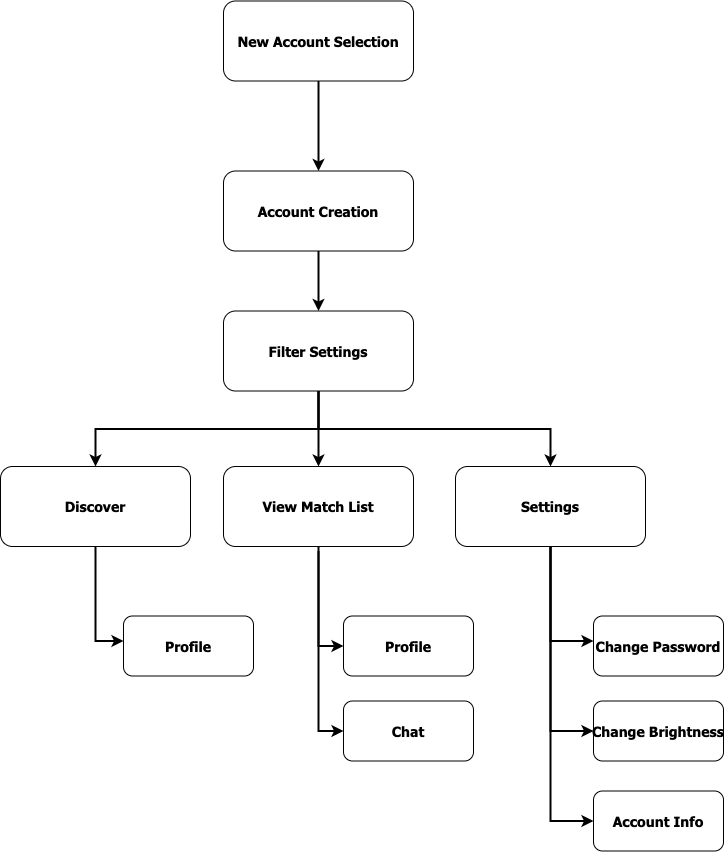
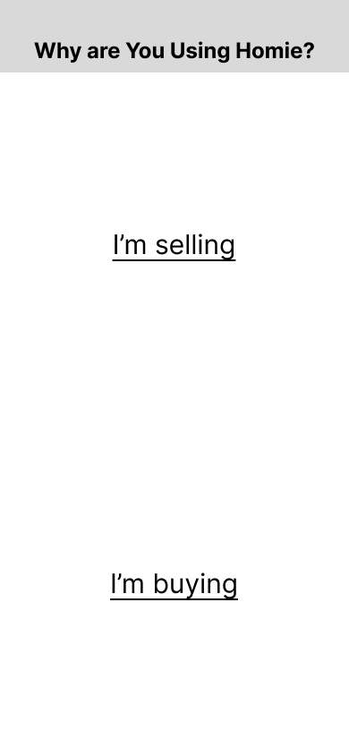
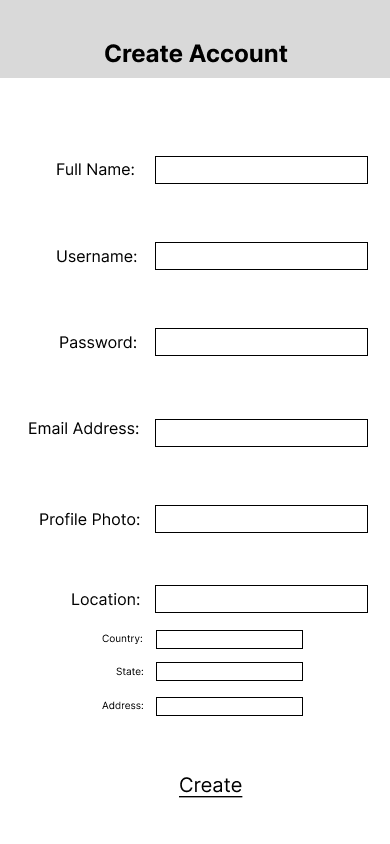
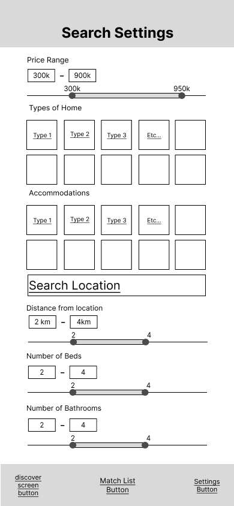
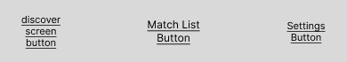
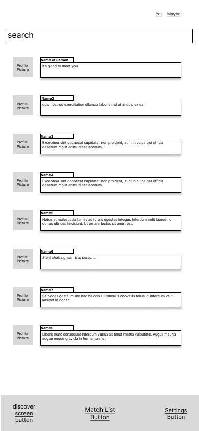
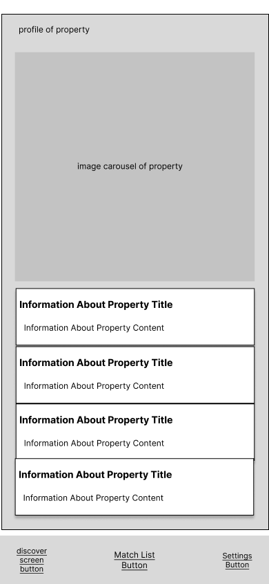
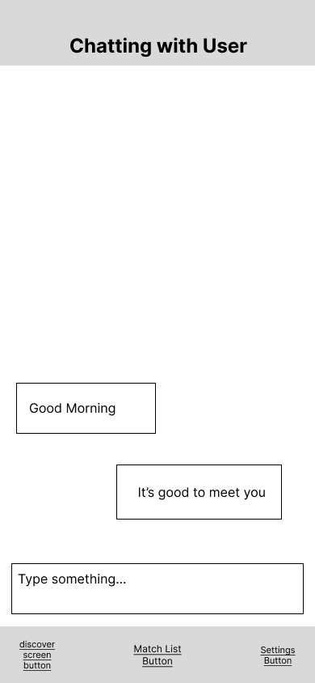
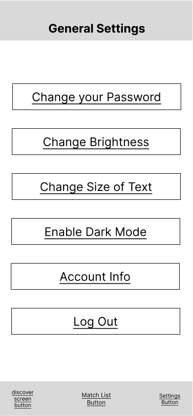

# HOMIE - User Experience Design

## Link to prototype
 

Click [Homie Prototype](https://www.figma.com/proto/YHV6RmuVbo3eGicqq4rGhC/Awesome-United-Wireframe?node-id=1%3A13&scaling=scale-down&page-id=0%3A1&starting-point-node-id=0%3A3&show-proto-sidebar=1)

 

## Site Map

 

 

##  New Account Selection
 

 

Frame wherein it asks new users if they are using the platform to advertise a lease for or sell a location. Or using the platform to buy or search for a lease. These two options are clickable components that when clicked, redirects the user to the
[Account Creation frame](##account-creation).

 

## Account Creation
 

 

This frame is for new users to the platform wherein they can create an account and fill-in information about themselves

 

## Filter/Search Settings
 

 

Frame wherein user can specify what listings they are looking for by location, size, occupancy etc.

 

## Footer
 

 

Present in every frame, except in the initial 'Account Creation' and 'New Account Selection' frames. The footer includes 3 clickable buttons, each when pressed will re-direct the end-user to a specific frame. 
- The 'Discover Screen' button redirects to [Discover frame](##discover)
- The 'Match List' button redirects to [View Individual Matches frame](##view-individual-matches)
- The 'Settings' button redirects to [Settings frame](##settings)

 

## Discover
 

 

Frame from which a user can browse the properties listed. Clicking on either of the "yes" "maybe" or "no" buttons, will result in the user being shown a new property listing.

- The "yes" button saves the current property to the user's "yes" category. This category is for listings the user intends to pursue further.

- The "maybe" button saves the current property to the user's "maybe" category. This category is for listings the user is unsure of and needs more time to think on or inquire about.

- The "no" button saves the current property to a non-viewable "no" category.

In all these cases, properties that have previously been categorized into "yes", "maybe", or "no" will not be shown further to the user in the "Discover" frame

 

## View Individual Matches

 

 

Shows all the "matches" a user has made. "matches" are any profiles with which a user has checked off as "yes" or "maybe". The user can switch between "yes" and "maybe" matches via the switch button on the upper right-hand corner. This switch really just filters the matches being shown within the frame.

A user's matches are listed vertically. If the user taps the profile picture of a match, it will take them to their match's profile. Additionally, if the user taps on the chat preview box or the name of their match, then the user will be re-directed to their chat session with the match.

 

## Profile View
 

 

Frame in which the user can view with a specific profile/property and its information.

 

## Chat
 

 

Frame in which a user can 'chat' or communicate with their match. Right side are the user's own messages, left side are the match's messages.

 

## Settings
 

 
Frame in which user can update their account info, update their preferences, filters, etc. "Change password" is clickable component that when clicked will take you to a seperate frame wherein a new password can be set. Likewise, "change brightness" and "change size of text" work similarly. "Enable dark mode" is also a clickable component, however, when clicked it changes the web-app's theme to dark. "Account info" is another clickable component which when clicked will take the user to their <i>own</i> profile. Finally, "log off" is a clickable component which when pressed logs off the user and takes them to the initial page.

 